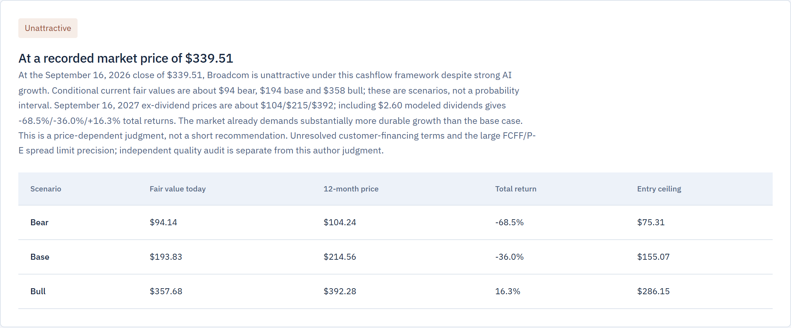
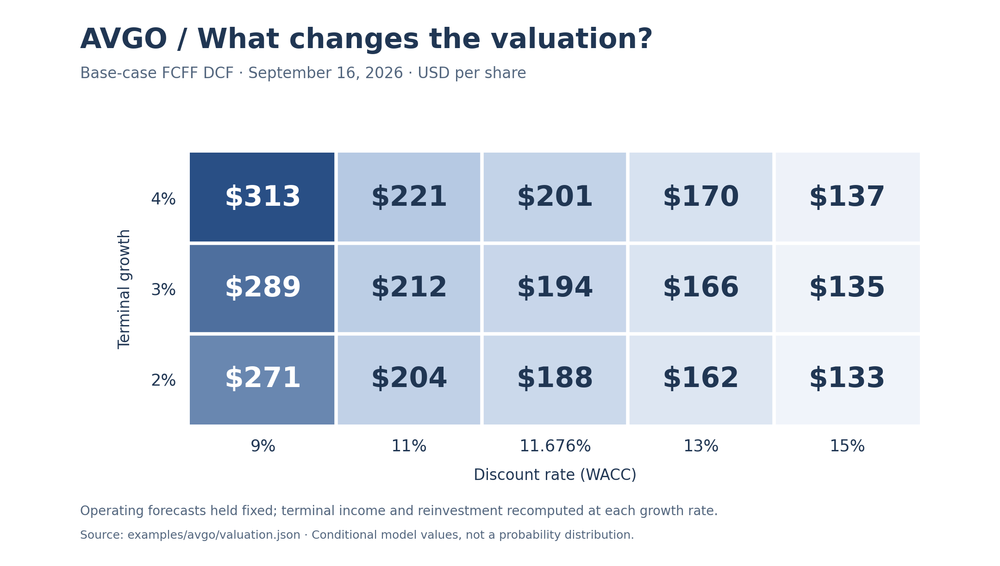
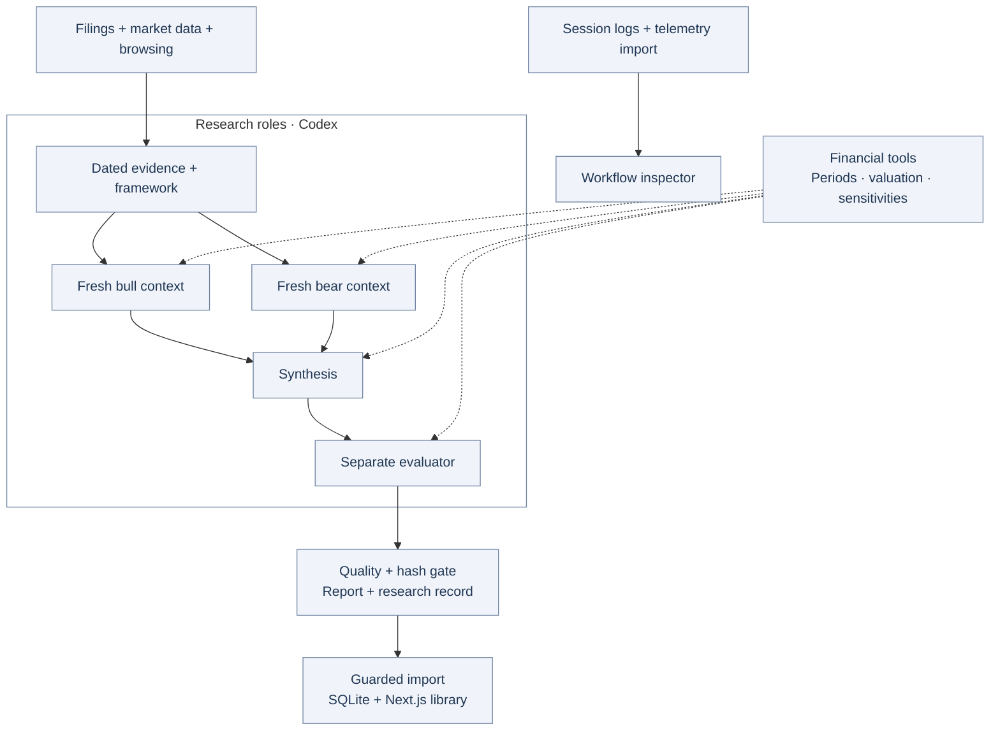

# Thesis

**Reproducible equity research. From source evidence to valuation.**

Thesis combines independent bull and bear analysis with deterministic financial models, source-linked evidence, and a separate quality review. Inspect the assumptions behind a valuation—and the workflow that produced it—in a local research workspace.

[AVGO case study](#avgo-case-study) · [Architecture](#architecture) · [Run locally](#run-locally) · [Read the example report](examples/avgo/report.md)



*Broadcom research at the September 16, 2026 cutoff. Values are conditional model outputs. The saved 87.5/100 review measures research quality; its two open minor findings and the later [critical assessment](docs/avgo-first-run-assessment.md) remain part of the record.*

## What I built

- **A deterministic valuation engine.** FCFF DCF, FCFE, P/E and enterprise multiples, with explicit equity bridges, diluted shares, dated dividends, entry policies and sensitivity grids. Financial drivers distinguish observations from assumptions. [Calculations](src/analyst/calculations.ts) · [Hand-checked examples](tests/analyst-calculations.test.ts)
- **An adversarial research workflow.** A common evidence packet and framework feed fresh bull and bear contexts. Synthesis compares their arguments; a separate evaluator checks material sources, calculations and decision usefulness. [Generator](.agents/skills/financial-brief-generator/SKILL.md) · [Evaluator](.agents/skills/financial-brief-evaluator/SKILL.md)
- **Evidence and publication controls.** Issuer, period, unit and cutoff checks; source-linked claims; SHA-256 artifact lineage; recalculation checks; and rejection of stale reviews or changed publications in the guarded import path. [Retrieval](src/analyst/retrieval.ts) · [Integrity checks](src/analyst/artifacts.ts) · [Publication](src/analyst/render.ts)
- **An inspectable application.** A persistent research library and run inspector expose reports, evidence, agent handoffs, interruptions and response-level token accounting. Repeat imports preserve the existing record; changed research creates a version. [Library](src/components/workspace.tsx) · [Telemetry](src/analyst/telemetry.ts)

## AVGO case study

**One company, competing assumptions, inspectable calculations.** The preserved Broadcom run connects financial-statement normalization, customer-financing exposure and operating forecasts to three valuation scenarios.

| Original FCFF scenario | Current modeled value / share |
| --- | ---: |
| Bear | $94.14 |
| Base | $193.83 |
| Bull | $357.68 |

These scenarios vary both operations and discount rates. The grid below isolates discount-rate and terminal-growth sensitivity while holding the base operating forecast fixed; terminal income and reinvestment are recomputed at each growth rate.



The base DCF estimate of approximately **$194** differs materially from the normalized P/E cross-check of approximately **$295**. That disagreement exposes model-selection risk. The [first-run assessment](docs/avgo-first-run-assessment.md) examines missing peer/consensus calibration and the distinction between intrinsic value, a horizon price and an entry policy.

[Report](examples/avgo/report.md) · [Research record](examples/avgo/research-record.md) · [Model inputs](examples/avgo/valuation-input.json) · [Calculated output](examples/avgo/valuation.json) · [Provenance and replay](examples/avgo/README.md)

## Architecture

**TypeScript · Next.js / React · SQLite / Drizzle · Zod · Vitest**



Model stages interpret evidence and choose assumptions; code calculates values and enforces contracts. The CLI does not launch models itself. Fresh research contexts reduce opinion carryover, while a shared model and filesystem still constrain independence.

The guarded analyst path requires **85/100**, every review dimension at least **3/4**, no open major/critical findings, and valid artifacts. Changing reviewed inputs invalidates the review. Legacy Markdown imports have a separate, less restrictive contract.

## Inspecting a research run

AVGO involved **seven contexts and 277 recorded research responses**. The coordinator accounted for **56.75%** of recorded tokens, identifying repeated context and status responses as optimization candidates. These are measured usage observations; savings have not yet been demonstrated.


Cached input is a subset of input; reasoning is a subset of output. The inspector deduplicates recorded responses and separates research from later handoff work. Token totals are not subscription bills. [Accounting rules and scope](docs/workflow-inspection.md)

<details>
<summary>See the AVGO agent handoffs</summary>


*Artifact handoffs from the preserved run. Each role's inputs, outputs and recorded activity can be inspected in the application.*

</details>

## Run locally

Requires **Node.js 22+** and npm. From the repository root:

```bash
npm install
npm run dev -- --port 3001
```

Open [127.0.0.1:3001](http://127.0.0.1:3001). A fresh checkout starts with an empty library; the AVGO example is browsable here on GitHub. Local storage and calculation replay require no API credentials.

Recompute the preserved valuation:

```bash
npm run analyst -- calculate --input examples/avgo/valuation-input.json --out .qa/avgo-recomputed.json
```

This reproduces arithmetic under frozen assumptions, without fetching sources or calling a model. See the [example guide](examples/avgo/README.md) for comparison and figure regeneration.

For fresh research, select Astra in a Codex task attached to the repository and ask:

> Use $financial-brief-generator to research AAPL and save the audited brief to Thesis.

Codex research consumes the account's model allowance. Source providers have separate configuration; the legacy browser **New analysis** route uses an OpenAI API key. [Analyst setup](docs/analyst.md) · [Data setup](docs/financial-data-setup.md)

## Validation and scope

```bash
npm test
npm run lint
npx tsc --noEmit
npm run build
```

Tests cover hand-calculated valuation examples, invalid financial periods, cutoff/identity conflicts, changed audit inputs, publication tampering, telemetry accounting and duplicate-safe imports. The included AVGO replay matches the saved JSON result. Implementation tests and a model-assigned quality score do not establish investment performance.

Thesis is research tooling for US-listed operating companies. It does not execute trades or provide calibrated return probabilities. Source coverage and financial judgment require review. Research data is processed by model providers; local-first describes storage and the application. **Not financial advice.**

## Documentation

[Analyst methods and gates](docs/analyst.md) · [Codex handoff](docs/codex-handoff.md) · [Workflow inspection](docs/workflow-inspection.md) · [AVGO assessment](docs/avgo-first-run-assessment.md) · [Legacy scorecard reference](docs/legacy-scorecard.md)
