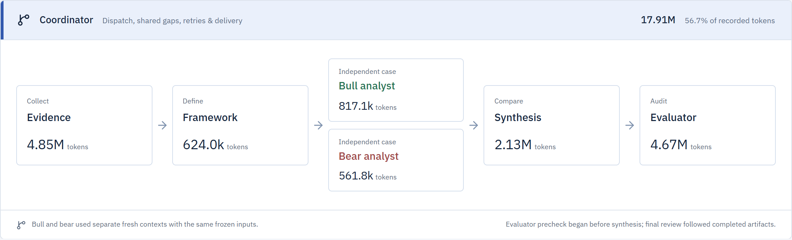
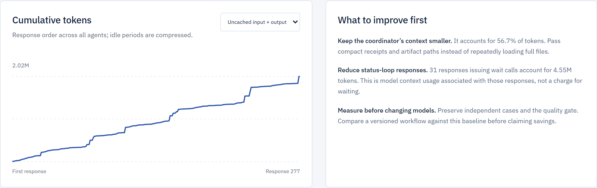

# README design plan

Audience: quant research and quant development internship reviewers. The first screen should establish the problem, show the working product, and make the technical contribution easy to investigate. Target roughly 700–900 words for the finished README, with deeper operational material linked from `docs/`.

## Positioning and opening copy

```markdown
# Thesis
### Reproducible equity research. From source evidence to valuation.

Thesis is a local-first research system that combines independent bull and bear analysis with deterministic financial models, source-linked evidence, and a separate quality review. Inspect the assumptions behind a valuation—and the workflow that produced it.

[Explore the AVGO case study](#avgo-case-study) · [Architecture](#architecture) · [Run locally](#run-locally)

<!-- AVGO results screenshot -->
```

Keep the title and proposition as selectable text. Use the app's navy, off-white and restrained blue in supporting graphics. Let real screenshots establish the visual identity. Avoid a decorative banner, badge wall, stock photos or generated product mockups. Add a CI badge only after an actual GitHub workflow exists and passes.

The strongest promise is traceability: source → financial driver → scenario → calculation → review → saved report. Quantitative credibility comes from explicit assumptions, reproducible arithmetic and honest evaluation boundaries.

## Page sequence

| Order | Section | Content and purpose |
| --- | --- | --- |
| 1 | Opening + product image | The copy above and a readable AVGO results screenshot. A reviewer should recognize financial models and a usable application immediately. |
| 2 | What I built | Four short bullets: deterministic valuation; independent research roles; source and artifact integrity; execution observability. Link each to its implementation. |
| 3 | AVGO case study | Dated, concrete example with a sensitivity graphic, a short methods comparison, and links to a curated report and reproducible calculation inputs. |
| 4 | Architecture | One GitHub-native Mermaid diagram distinguishing model reasoning, deterministic tools, and local storage. Explain the most consequential design choices beneath it. |
| 5 | Inspecting a research run | A focused usage screenshot and one measured finding about coordinator overhead. Link the full workflow inspector documentation. |
| 6 | Run locally | A short Node/npm startup block, then a separate, credential-free example for replaying saved valuation inputs. Explain that fresh research has separate setup. |
| 7 | Validation and limitations | Concrete tested failure cases, validation commands, and a short statement of what the project has and has not demonstrated. |
| 8 | Documentation | Compact links to analyst setup, workflow inspection, data setup, the AVGO assessment, and legacy pipeline documentation. |

## Visual assets

Use three primary visuals, with one optional screenshot inside a GitHub `<details>` block. Each visual should have useful alt text and a one-sentence caption that explains what the reader learns.

| Asset | Placement and framing | Status |
| --- | --- | --- |
| `docs/images/avgo-results.png` | Hero: capture the actual AVGO **Results & quality** view. Frame the scenario table and evidence/audit context at readable size. Include the historical research date in the caption. | Capture during implementation. |
| `docs/images/avgo-sensitivity.png` | Case study: plot the saved base-case discount-rate × terminal-growth grid. Label WACC, terminal growth, USD/share and the September 16, 2026 cutoff; retain the fixed operating assumptions in the caption. | Generate directly from `valuation.json` using a standard plotting library; no model call or new research. |
| `docs/images/avgo-usage.png` | Observability: focus a fresh screenshot on agent usage, the cumulative chart and the optimization observations. Explain cached input versus uncached input and output. | Existing full-page screenshot preserved below as a candidate; recapture a tighter view for the README. |
| `docs/images/avgo-workflow.png` | Optional expanded view: actual agent handoffs and inspectable inputs/outputs. Complements the system architecture diagram. | Existing full-page screenshot preserved below as a candidate. |

Capture at a consistent desktop width around 1440 px, ideally with sufficient pixel density for text to remain sharp at GitHub's narrower content width. Prefer a few legible sections over tall full-page screenshots. Use lossless PNG for interface text. Keep captions and dates in Markdown so they remain searchable. Check both GitHub themes and a narrow viewport.

### Existing AVGO workflow screenshot



### Existing AVGO usage screenshot



## Technical substance to foreground

| Contribution | Specific evidence to link |
| --- | --- |
| Financial modeling | `src/analyst/calculations.ts`: FCFF DCF, FCFE, P/E and enterprise multiples; explicit equity bridges; dated dividends; sensitivity calculations and conditional reverse P/E. |
| Evidence discipline | `src/analyst/retrieval.ts`, `periods.ts` and `contracts.ts`: issuer/date/unit constraints, source provenance, period reconciliation and explicit missing coverage. |
| Research workflow | Generator/evaluator skills: shared frozen inputs, fresh bull/bear contexts, synthesis and a separate evaluator. Separate contexts reduce opinion carryover; they do not establish statistical independence. |
| Integrity and publication | `src/analyst/artifacts.ts` and `render.ts`: stale-input detection, recomputation checks, audit thresholds and publication hashes. State that these guarantees apply to the guarded analyst import path. |
| Observability | `src/analyst/telemetry.ts` and the workflow inspector: response-level usage, agent timelines, interruptions and artifact inspection. |
| Application engineering | Next.js, TypeScript, SQLite/Drizzle and Zod: persistent library, repeat-safe imports, strict contracts, report navigation and Markdown export. |

Use a compact stack line near Architecture. Put financial and systems decisions ahead of framework versions.

## AVGO case-study narrative

Use the saved run `reports/AVGO/20260916T214341Z/`. Preserve its original artifacts and cutoff; this README task does not rerun or revise the research.

Suggested framing: **One company, competing assumptions, inspectable calculations.** Show how evidence becomes economic earnings, operating scenarios, discounted cash flows and an explicit entry policy.

Useful, verified details from the saved artifacts:

- Three original FCFF scenarios produce current values of approximately **$94 / $194 / $358 per share** for bear/base/bull. These are conditional model outputs with different operating and discount-rate assumptions. A screenshot caption must not imply calibrated probabilities or a statistical confidence interval.
- The base current DCF estimate is about **$194**, while the normalized P/E cross-check is about **$295**. Use that disagreement to explain model risk and why multiple methods need interpretation. Link the existing first-run assessment, which identifies missing market/peer calibration.
- Seven recorded contexts and 277 recorded research responses demonstrate the implemented workflow. The coordinator accounts for **56.75%** of recorded research tokens, giving a specific optimization hypothesis. No achieved savings are claimed.
- The saved original review scored **87.5/100** with two open minor findings. If retained in a screenshot or text, call it a saved research-quality assessment and link the later critique. It is not investment accuracy or proof of predictive performance.

Keep the main case-study text to roughly 150 words. The report, calculations and assessment carry the detail.

## Architecture diagram specification

Show three labeled groups:

1. **Evidence and research:** configured providers and browsing → dated source artifacts → evidence/framework → separate bull and bear contexts → synthesis → evaluator.
2. **Deterministic tools:** validation, period arithmetic, valuation and sensitivities. Draw relationships to research and evaluation stages, since calculations and checks are used throughout the workflow.
3. **Publication and application:** passing review + current artifact hashes → rendered report/research record → guarded import → SQLite library and Next.js UI. Session logs also feed the workflow inspector through the telemetry importer.

The CLI does not launch model research on its own. Codex orchestrates the research roles. Keep the legacy browser scorecard out of this primary workflow diagram and link its separate documentation.

## Public example and quick start

`reports/`, `data/` and `.qa/` are currently ignored by Git. A README linking only to them would leave a GitHub visitor without the evidence. During implementation, create a small tracked `examples/avgo/` package containing unchanged copies of the selected report, research record, valuation input and valuation output, with a short provenance README and original cutoff. Review the selected content for local paths and session details before publishing. Keep provider snapshots and session logs outside the public example.

Link the example report directly from the README. Offer a deterministic replay using the saved inputs:

```powershell
npm run analyst -- calculate --input examples/avgo/valuation-input.json --out .qa/avgo-recomputed.json
```

Verify that command against the curated files and compare the numerical result with the preserved output before documenting it as working. Explain that this reproduces arithmetic under frozen assumptions, not a fresh source check or a new quality audit. Avoid presenting the partial example package as a complete audited-import bundle.

For app startup, keep only `npm install` and `npm run dev -- --port 3001` in the primary block, with Node.js 22+ noted. Describe the fresh local library accurately; do not imply that an AVGO report is seeded automatically. Link credential and research setup separately.

## Documentation cleanup and acceptance

Move the current legacy scorecard formulas, API reference, cache behavior and detailed storage discussion into a dedicated linked document. Preserve that material while rewriting the README around the current analyst and inspector. Remove stale prose about a “new app” and its parent project.

Before implementation is finished:

- Verify each capability against the source and distinguish implemented behavior from planned improvements.
- Preserve the original research files; copy selected public examples without rewriting their findings.
- Check that images and examples are tracked and all relative links resolve on GitHub.
- Verify sample replay and startup instructions without a paid model call.
- Run the existing test suite before stating its current result; emphasize hand-checked financial examples, stale-audit rejection, chronology checks and duplicate-safe imports. Do not invent a coverage percentage or add a decorative test count.
- Preview Markdown, Mermaid and images at GitHub reading width. Ensure the historical date and model assumptions remain readable.
- End with concise scope: research tooling; no demonstrated trading edge or calibrated return probabilities; model judgment and source coverage remain limitations. Link the detailed assessment for evidence.

Implemented September 29, 2026. The README now includes the AVGO results view, a generated sensitivity figure, focused usage and workflow captures, a preserved public example with replay instructions, and a linked legacy scorecard reference. This document retains the original design rationale; the README and example guide describe the delivered files.
